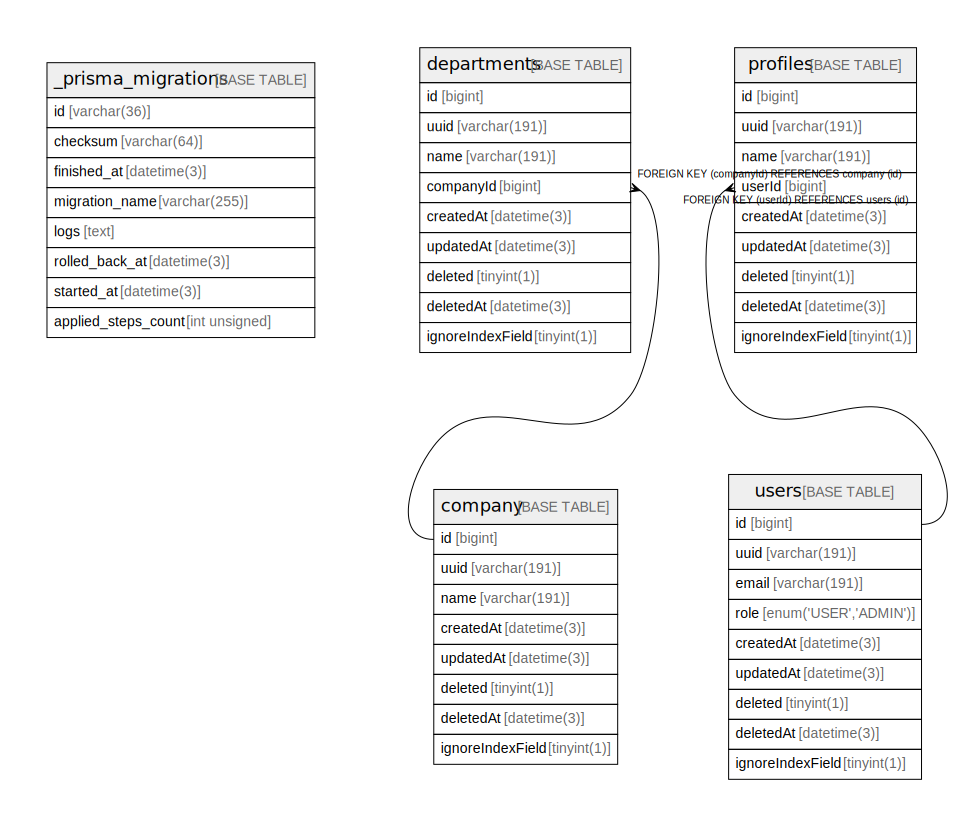

# database_name

## Tables

| Name | Columns | Comment | Type |
| ---- | ------- | ------- | ---- |
| [_prisma_migrations](_prisma_migrations.md) | 8 |  | BASE TABLE |
| [company](company.md) | 8 |  | BASE TABLE |
| [departments](departments.md) | 9 |  | BASE TABLE |
| [profiles](profiles.md) | 9 |  | BASE TABLE |
| [users](users.md) | 9 |  | BASE TABLE |

## Relations

---

> Generated by [tbls](https://github.com/k1LoW/tbls)
