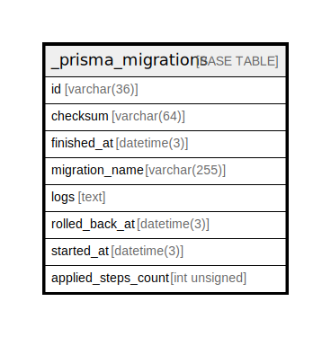

# _prisma_migrations

## Description

<details>
<summary><strong>Table Definition</strong></summary>

```sql
CREATE TABLE `_prisma_migrations` (
  `id` varchar(36) COLLATE utf8mb4_unicode_ci NOT NULL,
  `checksum` varchar(64) COLLATE utf8mb4_unicode_ci NOT NULL,
  `finished_at` datetime(3) DEFAULT NULL,
  `migration_name` varchar(255) COLLATE utf8mb4_unicode_ci NOT NULL,
  `logs` text COLLATE utf8mb4_unicode_ci,
  `rolled_back_at` datetime(3) DEFAULT NULL,
  `started_at` datetime(3) NOT NULL DEFAULT CURRENT_TIMESTAMP(3),
  `applied_steps_count` int unsigned NOT NULL DEFAULT '0',
  PRIMARY KEY (`id`)
) ENGINE=InnoDB DEFAULT CHARSET=utf8mb4 COLLATE=utf8mb4_unicode_ci
```

</details>

## Columns

| Name | Type | Default | Nullable | Extra Definition | Children | Parents | Comment |
| ---- | ---- | ------- | -------- | --------------- | -------- | ------- | ------- |
| id | varchar(36) |  | false |  |  |  |  |
| checksum | varchar(64) |  | false |  |  |  |  |
| finished_at | datetime(3) |  | true |  |  |  |  |
| migration_name | varchar(255) |  | false |  |  |  |  |
| logs | text |  | true |  |  |  |  |
| rolled_back_at | datetime(3) |  | true |  |  |  |  |
| started_at | datetime(3) | CURRENT_TIMESTAMP(3) | false | DEFAULT_GENERATED |  |  |  |
| applied_steps_count | int unsigned | 0 | false |  |  |  |  |

## Constraints

| Name | Type | Definition |
| ---- | ---- | ---------- |
| PRIMARY | PRIMARY KEY | PRIMARY KEY (id) |

## Indexes

| Name | Definition |
| ---- | ---------- |
| PRIMARY | PRIMARY KEY (id) USING BTREE |

## Relations



---

> Generated by [tbls](https://github.com/k1LoW/tbls)
