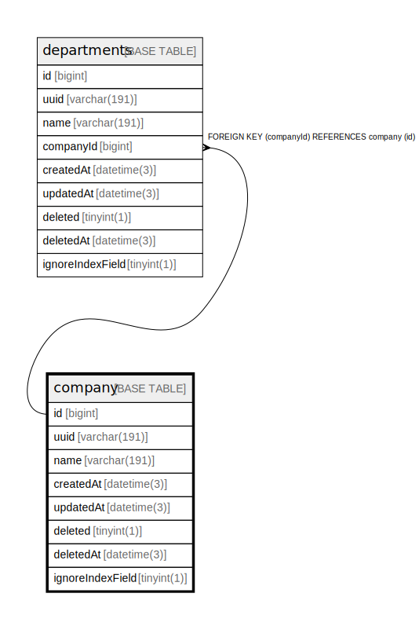

# company

## Description

<details>
<summary><strong>Table Definition</strong></summary>

```sql
CREATE TABLE `company` (
  `id` bigint NOT NULL AUTO_INCREMENT,
  `uuid` varchar(191) COLLATE utf8mb4_unicode_ci NOT NULL,
  `name` varchar(191) COLLATE utf8mb4_unicode_ci NOT NULL,
  `createdAt` datetime(3) NOT NULL DEFAULT CURRENT_TIMESTAMP(3),
  `updatedAt` datetime(3) DEFAULT NULL,
  `deleted` tinyint(1) DEFAULT '0',
  `deletedAt` datetime(3) DEFAULT NULL,
  `ignoreIndexField` tinyint(1) DEFAULT '0',
  PRIMARY KEY (`id`),
  UNIQUE KEY `company_uuid_key` (`uuid`),
  UNIQUE KEY `company_name_ignoreIndexField_key` (`name`,`ignoreIndexField`)
) ENGINE=InnoDB DEFAULT CHARSET=utf8mb4 COLLATE=utf8mb4_unicode_ci
```

</details>

## Columns

| Name | Type | Default | Nullable | Extra Definition | Children | Parents | Comment |
| ---- | ---- | ------- | -------- | --------------- | -------- | ------- | ------- |
| id | bigint |  | false | auto_increment | [departments](departments.md) |  |  |
| uuid | varchar(191) |  | false |  |  |  |  |
| name | varchar(191) |  | false |  |  |  |  |
| createdAt | datetime(3) | CURRENT_TIMESTAMP(3) | false | DEFAULT_GENERATED |  |  |  |
| updatedAt | datetime(3) |  | true |  |  |  |  |
| deleted | tinyint(1) | 0 | true |  |  |  |  |
| deletedAt | datetime(3) |  | true |  |  |  |  |
| ignoreIndexField | tinyint(1) | 0 | true |  |  |  |  |

## Constraints

| Name | Type | Definition |
| ---- | ---- | ---------- |
| company_name_ignoreIndexField_key | UNIQUE | UNIQUE KEY company_name_ignoreIndexField_key (name, ignoreIndexField) |
| company_uuid_key | UNIQUE | UNIQUE KEY company_uuid_key (uuid) |
| PRIMARY | PRIMARY KEY | PRIMARY KEY (id) |

## Indexes

| Name | Definition |
| ---- | ---------- |
| PRIMARY | PRIMARY KEY (id) USING BTREE |
| company_name_ignoreIndexField_key | UNIQUE KEY company_name_ignoreIndexField_key (name, ignoreIndexField) USING BTREE |
| company_uuid_key | UNIQUE KEY company_uuid_key (uuid) USING BTREE |

## Relations



---

> Generated by [tbls](https://github.com/k1LoW/tbls)
